<div align="center">

# 👋 Hi, I'm Redwan Hossain


<p>
  <strong>🚀 MERN Stack Developer</strong> &nbsp;•&nbsp;
  <strong>🎓 Computer Science Student</strong> &nbsp;•&nbsp;
  <strong>🇧🇩 Bangladesh</strong>
</p>


</div>

---


## 👨‍💻 About Me

* 🎓 I'm currently studying **Computer Science**
* 💻 I'm passionate about **MERN Stack Development**
* 🌱 Currently improving my **Backend & Database skills**
* ⚛️ I enjoy building applications with **React & Next.js**
* 🎨 I love creating **clean, modern & responsive UI**
* 🔧 Interested in **REST APIs, Authentication & Database Integration**
* 🚀 Always learning and building new projects
* 💬 Ask me about **Web Development**

<br clear="right"/>

---

## 🧰 Tech Stack

### 🎨 Frontend

<p>
  
</p>

### ⚙️ Backend & Database

<p>
  
</p>

### 🛠️ Tools & Technologies

<p>
  
</p>

---

## 🚀 Featured Projects

<table>
<tr>
<td width="50%">

### 🚗 DriveFleet

Car rental web application with modern UI, authentication, car browsing and booking functionality.

🔗 **[Live Demo](https://drivefleet-client-delta.vercel.app)**

</td>

<td width="50%">

### 🌍 WanderLust

Travel and destination management web application for exploring and managing travel destinations.

🔗 **[Live Demo](https://wanderlust-gold-ten.vercel.app)**

</td>
</tr>

<tr>
<td width="50%">

### 📚 SkillSphere

Learning platform focused on helping users explore and improve their skills.

🔗 **[Live Demo](https://skillsphere-webapp.vercel.app)**

</td>

<td width="50%">

### 📰 Dragon News

News website with a clean interface for browsing different categories of news.

🔗 **[Live Demo](https://dragon-news-lilac.vercel.app)**

</td>
</tr>

<tr>
<td width="50%">

### 🔐 Keen Keeper

A modern web application built with React and designed around clean UI and interactive functionality.

🔗 **[Live Demo](https://keen-keeper-app-mocha.vercel.app)**

</td>

<td width="50%">

### 🎬 Movie Explorer

Movie discovery application for exploring movies through an interactive interface.

🔗 **[Live Demo](https://movie-explorer-pied-nine.vercel.app)**

</td>
</tr>
</table>

### 📌 More Projects

* 📖 **English Vocabulary Learning** — [Live Demo](https://redwanhossain200.github.io/english-janala-code)
* 🧰 **Digitools WebApp** — [Live Demo](https://digitools-bd.netlify.app)
* 🏦 **Payoo Bank Website** — [Live Demo](https://redwanhossain200.github.io/payoo-code-redesign)
* 💼 **Job Application Website** — [Live Demo](https://redwanhossain200.github.io/A-04-practice)
* 🐼 **Panda Landing Page** — [Live Demo](https://redwanhossain200.github.io/Panda-project)
* 📸 **Influencer Gear** — [Live Demo](https://redwanhossain200.github.io/influencer-gear)
* 📚 **Knowledge Vault** — [Live Demo](https://redwanhossain200.github.io/B13-A01)

---

## 📊 GitHub Analytics

<div align="center">





</div>

---

## 🔥 GitHub Streak

<div align="center">


</div>

---

## 🎯 2026 Goals

* 🚀 Build more **real-world full-stack applications**
* ⚛️ Deepen my knowledge of **React & Next.js**
* 🟢 Strengthen my **Node.js & Express.js** skills
* 🗄️ Learn **MongoDB & database architecture** deeply
* 🔐 Improve my knowledge of **Authentication & Authorization**
* 🌍 Contribute to **Open Source Projects**
* 💼 Prepare for opportunities as a **Full-Stack Web Developer**

---

## 📈 Currently Learning

```text
Frontend        ███████████████████░   React / Next.js
Backend         ████████████████░░░░   Node.js / Express.js
Database        ███████████████░░░░░   MongoDB
Authentication  █████████████░░░░░░░   Better Auth / Auth Systems
UI/UX           ████████████████░░░░   Responsive & Modern UI
```

---

## 🤝 Connect With Me

<div align="left">

<a href="https://www.instagram.com/mdredwanhossain2007/" target="_blank">
  
</a>

<a href="https://www.linkedin.com/in/redwan-hossain-dev/" target="_blank">
  
</a>

<a href="mailto:mdredwanhossain2007@gmail.com">
  
</a>

</div>

---

<div align="center">

## 🐍 Contribution Snake


<br/><br/>

### ✨ Code • Learn • Build • Improve ✨

</div>
